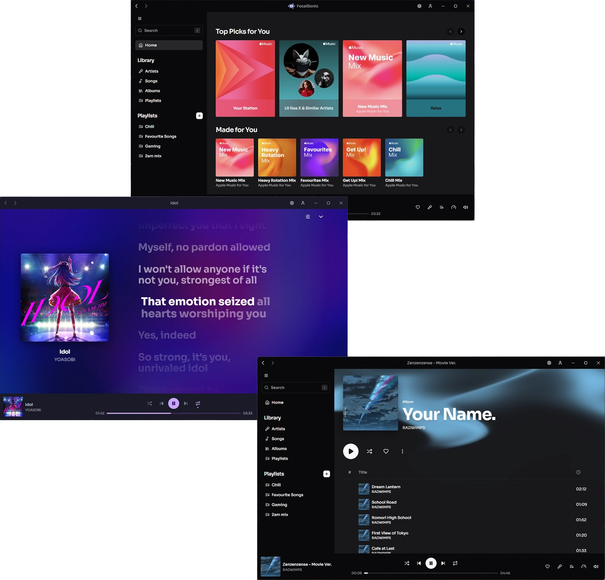

# FocalSonic 

Free and open source Apple Music client for Windows 11

# Features

- **Customization** - Easily customize the colors and fonts of the UI
- **Background Audio Playback** - Save resources by closing the player window
- **Speed Control** - Slow down or speed up your music with smooth time stretching
- **Lyrics** - Support for syllable-synced lyrics, including pronunciations for foreign languages
- **Discord RPC** - Show off what you're listening to on your Discord profile
- **Apple Music Radio** - Radio playback from personal radio stations 
- **Dolby Atmos** - (EXPERIMENTAL) Dolby Atmos on a select number of tracks from Apple's library

## Future Plans

 - Linux support

## Not Planned / Won't Implement

 - ❌ Lossless audio 
 Reason: Apple doesn't provide any legal method of playing DRM protected lossless files on Windows.

 - ❌ AutoMix / Sing / Apple Intelligence features  
 Reason: Windows PCs don't support Apple Intelligence

 - ❌ macOS support  
 Reason: A lot of work to put in with little demand, the official client for macOS is quite good already.
 

Please do not open issues regarding these features.

## Contributing
Pull requests are accepted, we would be glad to incorporate your contributions.

Ensure to install the following dependencies:
- .NET 9
- NodeJS / NPM

After that, running from source is simple:  
1. `git clone https://github.com/SamsidParty/FocalSonic.git`
2. `cd ./FocalSonic/FocalSonic`
3. `dotnet run`